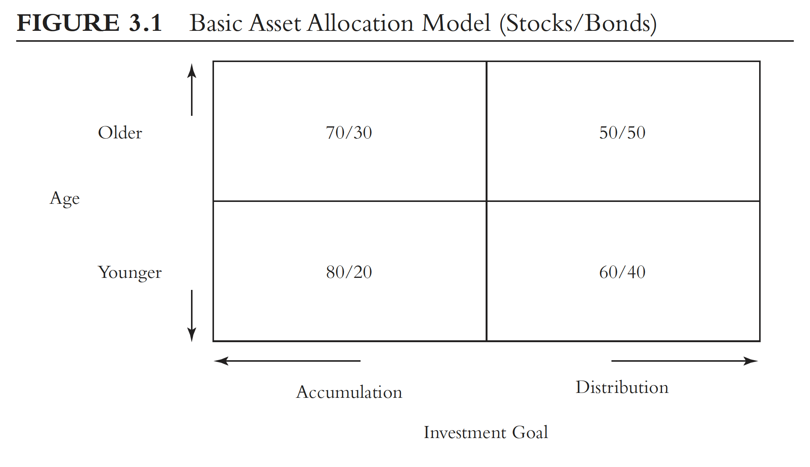

# On Asset Allocation

For nearlly all investors, the principal asset classes of choice boil down to common stocks (for maximum total return), bonds (for reasonable income), and cash reserves (for stability of principal). Each differs in risk: stocks are the most volatile, bonds are less so, and the nominal value of cash reserves is inviolable.

Modern Portfolio theory:

Investors almost universally accept it. It is based on developing investment portfolios that seek returns that optimize the investor's willingness to assume risk. Risk is defined in terms of short-term fluctuations in expected value.

In its most comprehensive form, modern portfolio theory dictates that portfolio composition should include all liquid asset classes — not only U.S. stocks, bonds, and cash reserves, but international investments, short positions, foreign exchange, and various curios (gold, for example) from the financial marketplace.

The author focus on stocks and bonds.

* Short term bonds are relatively insensitive to interest rate fluctuations, long-bonds are hugely sensitive.&#x20;
* Most of the examples in the book are based on intermediate-term and long-term bonds.

The simple guideline of the author:

* Two-thirds in stocks, one-third in bonds.

Four dimensions of investing:

* **Return**
* **Risk**
* **Cost**
* **Time**

With a longer time horizon you can afford to take more risk than if it is short and vice versa.

<figure><figcaption>
It seems 50/50 would be ideal for me? Or right now start with 60/40
</figcaption></figure>

Another advice as a starting point could be your age as the percentage of bond position. So, for instance, a 35 years old would have a 35(bond)/65(stock) percentage allocation. Obviously this depends on the investor objectives, risk tolerance and financial position.&#x20;

You can have three strategies, regarding the dynamics of the process:

* Keep the ratio: For this you have to reallocate from one to another (stocks to bonds and viceversa) maybe selling and moving the the other one. However the smartest thing is just to allocate more of the new funds to the one needed in order to rebalance the ratio, because when selling there could be taxes and fees to take into account. With this implicitly you automatically lock in your gains and reduce your equity exposure as equity prices increase (if you are moving from equity to bonds, which is the most common thing)
* Let your investments ride: With this you just set an initial allocation, but do nothing and let it go however it is.
* Tactical asset allocation: Do midcourse corrections if you see that its good in the long term. This is only recommended to skilled investors.

I believe that in my case the first one would be the best one, maybe doing some adjustments in the percentage allocation of new funds following the age rule mentioned.

Regarding the third dimension, cost, take into account:

* Although Investment Policy (ie the allocation of assets) dominates Investment Strategy (market timing and security selection) explaining on average 93.6% of the variation of **quarterly variations of returns** this true **as long as cost is held constant and low.** In other words, make your selections from among the lower - cost funds.

This is because in the **long term** investment policy explained only 14.6% of the differences in the total returns.

**For many individual investors, cost is the most important determinant of portfolio performance, not asset allocation policy, market timing, or security selection.**

The author considers that both Cost and Asset allocation are critically important.

<figure><figcaption>
Here you can see the importance of expense rations for many types of funds
</figcaption></figure>

**The lowest - cost funds not only have the highest net**\
**returns (as we would expect) but the highest gross returns, even before costs are deducted (not clear why this should be but it is a pattern that further enhances the simple, low - cost strategy: "Do your fishing in the low - cost pond!").**

Page 134
